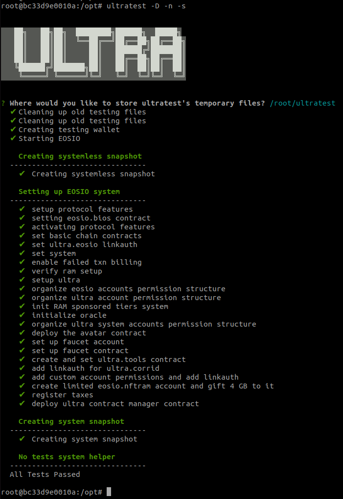

# Creating and Compiling Smart Contracts with Docker
This document guides you on how to create, compile, and deploy smart contracts using Ultra's 3rd party Docker image.

## Prerequisites
Before you begin, ensure that Docker is installed on your computer and you can use the Developer Tools Docker image. For guidance, refer to the [Tutorial - Install Docker and get started with Developer Tools Docker image](getting-started.md) tutorial.


## Step 1: Pull the Ultra Image
Pull the Ultra 3rd party Docker image with the following command:

```sh
docker pull quay.io/ultra.io/3rdparty-devtools
```

Verify the Ultra image with the following command:
```sh
docker image ls quay.io/ultra.io/3rdparty-devtools
```


## Step 2: Start the Docker Container
Start the Docker container, which contains the smart contract developer tools and a local Ultra Blockchain, using the following command:

```sh
docker run -dit --name ultra -p 8888:8888 -p 9876:9876 -v ~/ultra_workdir:/opt/ultra_workdir quay.io/ultra.io/3rdparty-devtools
```

Verify that the Ultra Docker container is up and running with:

```sh
docker ps -a
```


## Step 3: Start the Local Chain in the Docker Container
Log in to the container with:

```sh
docker exec -it ultra /bin/bash
```

Start the local Ultra Blockchain with:

```sh
ultratest -D -n -s
```
Accept the default recommendation for the temporary files location by pressing enter.



### Step 3a: Verify the Local Chain is Running
Execute the following command inside the container:

```sh
cleos get info
```

Or from outside the container on the host machine:
```sh
docker exec ultra cleos get info
```


## Step 4: Create and Compile the Smart Contract
Create a directory on your host machine in `ultra_workdir/hello` and create a file named `hello.cpp` with the following content:

```cpp
#include <eosio/eosio.hpp>

class [[eosio::contract]] hello : public eosio::contract {
public:
using contract::contract;

[[eosio::action]]
void hi(eosio::name user) {
    eosio::print("Hello, ", user);
}
};
```

Save it, then compile it with the following command:

```sh
docker exec ultra cdt-cpp -o /opt/ultra_workdir/hello/hello.wasm /opt/ultra_workdir/hello/hello.cpp
```

Verify that two new files, `hello.abi` and `hello.wasm`, were created in the hello directory.

## Step 5: Create an Account for Deployment
Inside the Docker container, create a private and public key pair:

```sh
cleos create key --to-console
```

You will see a generated key pair:

```sh
Private key: 5KPNRT7C4CJs9ddNTieC5fL92NQNk82Nxb1EQ5sL4siGhU4oxcV
Public key: EOS7crhavXnYD6LcbfXQuF4GoqWsS8zdYvVXyv2AV9HSFLa75PHCD
```
Import the key into your local wallet:

```sh
cleos wallet import --private-key 5KPNRT7C4CJs9ddNTieC5fL92NQNk82Nxb1EQ5sL4siGhU4oxcV
```

Create an account named helloacc using your public key:
```sh
cleos system newaccount --gift-ram-kbytes 128 eosio helloacc EOS7crhavXnYD6LcbfXQuF4GoqWsS8zdYvVXyv2AV9HSFLa75PHCD EOS7crhavXnYD6LcbfXQuF4GoqWsS8zdYvVXyv2AV9HSFLa75PHCD
```

Verify the account:

```sh
cleos get account helloacc
```


## Step 6: Deploy the Smart Contract
Deploy the smart contract to helloacc:

```sh
cleos set contract helloacc /opt/ultra_workdir/hello hello.wasm hello.abi
```

If you encounter the error account helloacc does not have KYC info, execute:

```sh
cleos push action eosio.kyc togglekyc '[]' -p ultra.kyc
```

Then retry the deployment command.

Verify the deployment:

```sh
cleos get code helloacc
```

If the code hash is not zero, the contract has been successfully deployed.

## Step 7: Interact with Your Smart Contract
Call the hi action of the hello smart contract:

```sh
cleos push action helloacc hi '["alice"]' -p helloacc@active
```
The output will be "Hello, alice".


Note: The hi action uses eosio::name parameter, so using capital letters will result in an Invalid name error:

```sh
cleos push action helloacc hi '["Alice"]' -p helloacc@active
```
Always use names that conform to the EOSIO naming rules: lowercase letters, digits, and periods, with a maximum length of 12 characters.


## Step 8: Cleanup Process
Logout from the Docker container by typing exit or pressing CTRL+D.

Stop the container:

```sh
docker stop ultra
```

Remove the container:

```sh
docker rm ultra
```

Verify the removal:

```sh
docker ps -a
```

The ultra container should not appear in the list.

