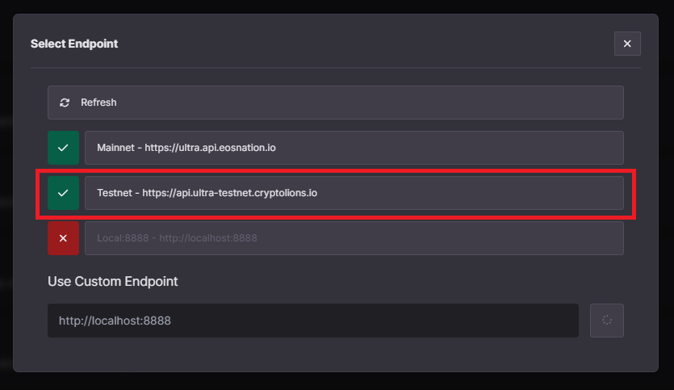
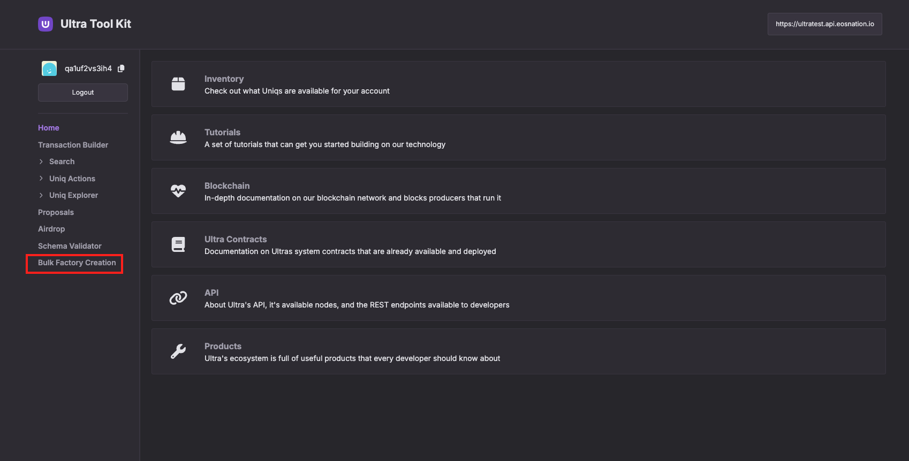
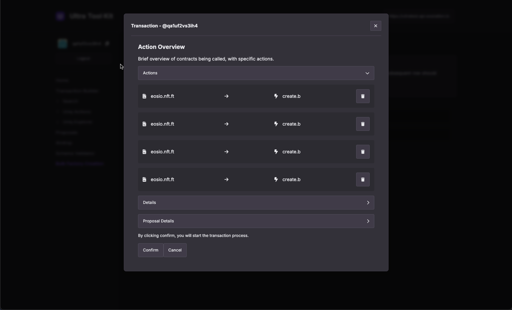
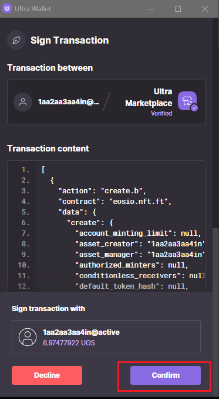
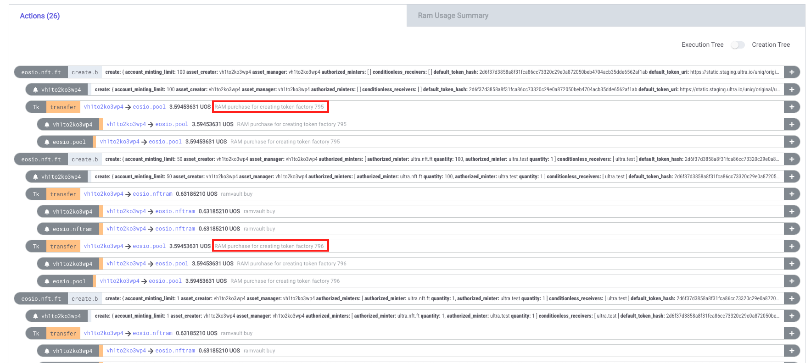
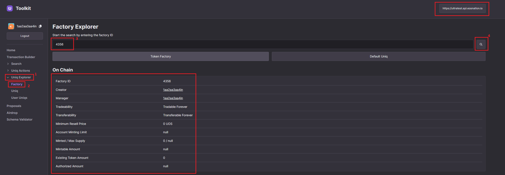

# How to create multiple Uniq Factories using the Ultra Tool Kit

## Prerequisites

- A basic understanding
  of [Factory Metadata](../uniq-variants/factory-metadata.md), [Default Uniq Metadata](../uniq-variants/uniq-default-metadata.md)
  and [Uniq Metadata](../uniq-variants/uniq-metadata.md).
- Ultra Tool Kit Account: Ensure you are logged in and have access to the Ultra Toolkit.
- You will need a Google account to make a copy of the [Bulk Factory Creation - Template](https://docs.google.com/spreadsheets/d/17xvyrAUYB-3Hugu0UY2A4SnA2RbXLVuNv3K_gyca6xY/edit?usp=sharing).
- CSV File: Prepare a CSV file containing all the necessary data for creating Uniq Factories. Each row in the file will
  represent a single Uniq Factory.

## Goal

The goal of this tutorial is to guide developers through the process of efficiently creating multiple Uniq Factories
using the Ultra Tool Kit. By following this step-by-step guide, you will learn how to prepare a CSV file that allows for
the bulk creation of Uniq Factories, reducing the need for manual input and ensuring consistency across all your
entries. This method is particularly useful for large-scale operations where numerous Uniq Factories need to be deployed
quickly and accurately.

## Accessing the Tool Kit

To access the Ultra Tool Kit, please visit: https://toolkit.ultra.io

Once you're on the Tool Kit homepage, click on the network selection component on the top right of your screen.

Clicking on the network selection component will open up a list of available networks that you can use the toolkit on.
For the sake of this tutorial, we will be using the Ultra Testnet. From the list of available networks, click on
`Testnet`.

Login to the Ultra Tool Kit using Ultra Wallet. Refer
to [Tutorial - Log in to the Ultra Tool Kit](../../fundamentals/tutorial-login-to-toolkit.md) for more information.

## Creating Multiple Uniq Factories

### 1. Accessing Bulk Factory Creation

Once you've logged in to the tool kit, from the tool kit home page, click on the `Bulk Factory Creation` from the
sidebar, to open the creation tool.

### 2. Preparing CSV Template

The first step is to prepare your CSV file. This file will contain all the properties required to create each Uniq
Factory. You can download a CSV Template from the Tool Kit on the `Bulk Factory Creation` page:

Here’s an example of what your CSV file might look like:

| memo       | asset_manager | asset_creator | minimum_resell_price | mintable_window_start | mintable_window_end | trading_window_start | trading_window_end | recall_window_start | recall_window_end | max_mintable_tokens | lock_hash | lockup_time | stat | account_minting_limit | transfer_window_start | transfer_window_end | maximum_uos_payment | factory_uri | factory_hash                                                     | default_token_uri | default_token_hash                                               | resale_shares_1  | resale_shares_2  | resale_shares_3 | resale_shares_4 | resale_shares_5 | conditionless_receivers_1 | conditionless_receivers_2 | conditionless_receivers_3 | conditionless_receivers_4 | conditionless_receivers_5 | authorized_minters_1 | authorized_minters_2 | authorized_minters_3 | authorized_minters_4 | authorized_minters_5 |
|------------|---------------|---------------|----------------------|-----------------------|---------------------|----------------------|--------------------|---------------------|-------------------|---------------------|-----------|-------------|------|-----------------------|-----------------------|---------------------|---------------------|-------------|------------------------------------------------------------------|-------------------|------------------------------------------------------------------|------------------|------------------|-----------------|-----------------|-----------------|---------------------------|---------------------------|---------------------------|---------------------------|---------------------------|----------------------|----------------------|----------------------|----------------------|----------------------|
| Factory #1 | vh1to2ko3wp4  | vh1to2ko3wp4  | 100.00000000 UOS     | 2021-05-31 0:00:00    |                     | 2021-05-31 0:00:00   |                    |                     |                   | 1000                |           |             | 0    | 100                   |                       |                     |                     | http://...  | 2d6f37d3858a8f31fca86cc73320c29e0a872050beb4704acb35dde6562af1ab | http://...        | 2d6f37d3858a8f31fca86cc73320c29e0a872050beb4704acb35dde6562af1ab | ultra.nft.ft:250 |                  |                 |                 |                 |                           |                           |                           |                           |                           |                      |                      |                      |                      |                      |
| Factory #2 | vh1to2ko3wp4  | vh1to2ko3wp4  | 1.00000000 USD       | 2021-05-31 0:00:00    |                     | 2021-05-31 0:00:00   |                    |                     |                   | 250                 |           |             | 0    | 50                    |                       |                     |                     | http://...  | 2d6f37d3858a8f31fca86cc73320c29e0a872050beb4704acb35dde6562af1ab | http://...        | 2d6f37d3858a8f31fca86cc73320c29e0a872050beb4704acb35dde6562af1ab | ultra.nft.ft:250 | vh1to2ko3wp4:150 |                 |                 |                 | ultra.test                |                           |                           |                           |                           | ultra.nft.ft:100     | ultra.test:1         |                      |                      |                      |
| Factory #3 | vh1to2ko3wp4  | vh1to2ko3wp4  |                      |                       |                     |                      |                    |                     |                   | 10                  |           |             | 0    | 1                     |                       |                     |                     | http://...  | 2d6f37d3858a8f31fca86cc73320c29e0a872050beb4704acb35dde6562af1ab | http://...        | 2d6f37d3858a8f31fca86cc73320c29e0a872050beb4704acb35dde6562af1ab | ultra.nft.ft:250 | vh1to2ko3wp4:150 | ultra.test:150  |                 |                 | ultra.test                |                           |                           |                           |                           | ultra.nft.ft:1       | ultra.test:1         |                      |                      |                      |
| Factory #4 | vh1to2ko3wp4  | vh1to2ko3wp4  | 15500.00000000 UOS   | 2024-05-31 0:00:00    |                     | 2021-05-31 0:00:00   |                    |                     |                   |                     |           |             | 0    | 100                   |                       |                     |                     | http://...  | 2d6f37d3858a8f31fca86cc73320c29e0a872050beb4704acb35dde6562af1ab | http://...        | 2d6f37d3858a8f31fca86cc73320c29e0a872050beb4704acb35dde6562af1ab | ultra.nft.ft:250 |                  |                 |                 |                 |                           |                           |                           |                           |                           |                      |                      |                      |                      |                      |

**Note**: Empty cells in the CSV are treated as null fields, meaning those properties will not be set for the
corresponding Uniq Factory.

Each column in your CSV corresponds to a specific parameter in the `create.b` action as described in
the [create.b action documentation](../../../blockchain/contracts/nft-contract/nft-actions/create.b.md). Here's a
breakdown of each field:

Based on
the [Ultra developer documentation](https://developers.ultra.io/blockchain/contracts/nft-contract/nft-actions/create.b.html#create-b)
for the `create.b` action, I've added the "Required" column to indicate whether each parameter is mandatory or optional.
Here's the updated table:

| CSV Column                           | Required | Description                                                                                                                                                                                               |
|--------------------------------------|----------|-----------------------------------------------------------------------------------------------------------------------------------------------------------------------------------------------------------|
| **`memo`**                           | Yes      | Stores a string value (up to 256 bytes) providing additional context or information about the factory creation. Corresponds to the `memo` parameter in the `create.b` action.                             |
| **`asset_creator`**                  | Yes      | Specifies the account name of the asset creator, who must sign the transaction. Maps directly to the `asset_creator` parameter.                                                                           |
| **`asset_manager`**                  | Yes      | Identifies the account responsible for managing the factory. The `asset_manager` must sign the transaction and pay for the RAM used to store token factory data. Maps to `asset_manager`.                 |
| **`minimum_resell_price`**           | No       | Specifies the minimum price (in UOS or USD) at which tokens from the factory can be resold. Tokens cannot be sold below this price. Maps to `minimum_resell_price`.                                       |
| **`resale_shares_[1..5]`**           | No       | Specifies resale shares, detailing accounts that receive a percentage of the resale price. Each share has a receiver and a basis point value. Maps to `resale_shares`.                                    |
| **`mintable_window_start`**          | No       | Defines the start of the time window during which tokens from this factory can be minted. Date in UTC format. Maps to `mintable_window_start`.                                                            |
| **`mintable_window_end`**            | No       | Defines the end of the time window during which tokens from this factory can be minted. Date in UTC format. Maps to `mintable_window_end`.                                                                |
| **`trading_window_start`**           | No       | Specifies when tokens from this factory can start being traded. Date in UTC format. Maps to `trading_window_start`.                                                                                       |
| **`trading_window_end`**             | No       | Specifies when tokens from this factory can no longer be traded. Date in UTC format. Maps to `trading_window_end`.                                                                                        |
| **`recall_window_start`**            | No       | Defines when tokens can start being recalled after minting. Represented as time intervals since minting (in seconds) or specific dates. Maps to `recall_window_start`.                                    |
| **`recall_window_end`**              | No       | Defines when tokens can no longer be recalled after minting. Represented as time intervals since minting (in seconds) or specific dates. Maps to `recall_window_end`.                                     |
| **`max_mintable_tokens`**            | Yes      | Specifies the maximum number of tokens that can be minted by the factory. If blank, unlimited tokens can be minted. Maps to `max_mintable_tokens`.                                                        |
| **`lockup_time`**                    | No       | Defines the duration (in seconds) that tokens remain locked after minting. Tokens cannot be transferred or resold during this time unless transferred to a conditionless receiver. Maps to `lockup_time`. |
| **`conditionless_receivers_[1..5]`** | No       | Lists accounts that can receive tokens without adhering to transfer or lockup restrictions. Maps to `conditionless_receivers`.                                                                            |
| **`stat`**                           | Yes      | Indicates the initial status of the factory (`0` for active, `1` for inactive, `2` for shutdown). Maps to `stat`.                                                                                         |
| **`factory_uri`**                    | Yes      | Contains the base URI pointing to the factory's metadata, required for factory creation. Maps to `factory_uri`.                                                                                           |
| **`factory_hash`**                   | No       | Optional field storing the SHA256 hash of the factory metadata file, ensuring data integrity. Maps to `factory_hash`.                                                                                     |
| **`authorized_minters`**             | No       | Specifies accounts authorized to mint tokens from the factory, along with the quantity they can mint. Maps to `authorized_minters`.                                                                       |
| **`account_minting_limit`**          | No       | Limits the number of tokens each account can mint. If blank, there is no limit. Maps to `account_minting_limit`.                                                                                          |
| **`transfer_window_start`**          | No       | Defines when tokens from the factory can start being transferred. Maps to `transfer_window_start`.                                                                                                        |
| **`transfer_window_end`**            | No       | Defines when tokens from the factory can no longer be transferred. Maps to `transfer_window_end`.                                                                                                         |
| **`maximum_uos_payment`**            | No       | Specifies the maximum amount of UOS that the factory creation transaction can cost. Maps to `maximum_uos_payment`.                                                                                        |
| **`default_token_uri`**              | Yes      | Points to the default URI for the token metadata, used when there is no specific metadata for a token. Maps to `default_token_uri`.                                                                       |
| **`default_token_hash`**             | No       | Optional field containing the SHA256 hash of the default token URI content, ensuring its integrity. Maps to `default_token_hash`.                                                                         |
| **`lock_hash`**                      | No       | Boolean field indicating whether to lock the metadata hashes, preventing further changes. Maps to `lock_hash`.                                                                                            |

These columns in your CSV template represent the necessary inputs to create multiple Uniq Factories using Ultra's
`create.b` action efficiently. Each column directly maps to a specific parameter in the smart contract, ensuring that
the factories are created with all the required settings.

### 3. Uploading the CSV File

Once your CSV file is ready, you can upload it to the Ultra Tool Kit for processing.

1. **Log in** to your Ultra Tool Kit account.
2. **Click** on "Bulk Factory Creation"
3. **Upload** your CSV file.

After uploading, the Ultra Tool Kit will parse the CSV file and begin processing each line. Each row in the CSV file is
translated into a transaction on the blockchain. The `create.b` action is applied to each row, creating a new Uniq
Factory

### 4. Review `create.b` Actions

Once you have uploaded, click on the `Create (x) Action` button and it will open up the transaction confirmation modal.
You can click on the `Details` button to view the transaction in JSON form. Click on the `Confirm` button to submit your
transaction.

Confirm and sign the transaction using the Ultra Wallet extension. This step is crucial as it authorizes the blockchain
to execute the transfer under your account.

After signing the transaction, you will see a confirmation screen indicating that the transaction was successfully
completed. To check the transaction on the block explorer, click on the `View in Explorer` text.

You'll find a list of actions on the block explorer transaction page. Since this is a bulk operation, a single
transaction will contain multiple actions, each corresponding to the creation of a separate Uniq Factory. Look for the
text that says RAM purchase for creating token factory <FACTORY_ID>. Each of these lines will display the ID for a newly
created Uniq Factory. For instance, if you created multiple factories, you might see texts like RAM purchase for
creating token factory 4356, RAM purchase for creating token factory 4357, and so on. The IDs are sequential and
correspond to the order of entries in your CSV file. You’ll need these IDs for upcoming guides.

### 5. Verifying Factory Creation

1. To verify the successful creation of your Uniq Factory, go to the `Factory Explorer` page on the tool
   kit (https://toolkit.ultra.io/uniqFactory).
2. Make sure you are using the Ultra Testnet environment.
3. Use the factory ID you obtained in the previous step to search for your Uniq Factory. Simply enter the ID and click
   the search button. You should then be able to view the details of your Uniq Factory.

You have now successfully created your Uniq Factories using the Ultra Tool Kit.

## What's next?

Once you have created your Uniq Factories, the next step is to mint your first Uniq.
Refer [How to mint a Uniq using the Ultra Tool Kit](./how-to-mint-uniq-using-toolkit.md).
