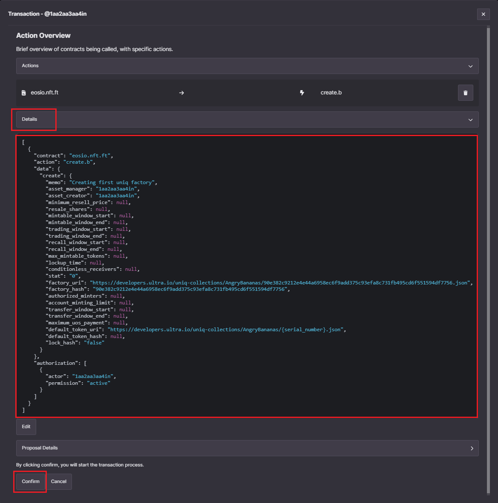
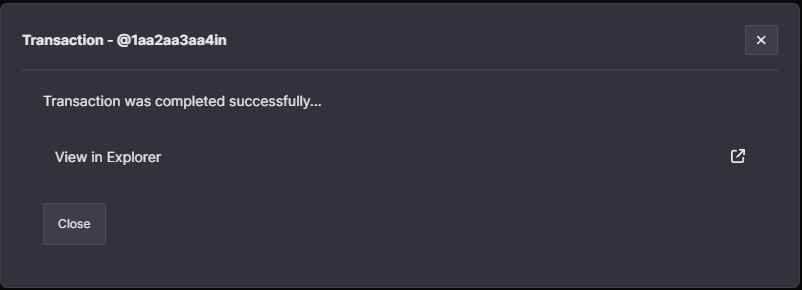

# How to create a Uniq Factory using the Ultra Tool Kit

## Prerequisites

-   You must have created and uploaded the uniq metadata files. See [How to create Uniq Metadata](./how-to-create-uniq-metadata.md) for more information.
-   Your account must have sufficient UOS tokens for transactions and fees. Refer to [Tutorial - Using the Faucet and Buying RAM on Ultra Testnet](../../fundamentals/tutorial-obtain-token-and-purchase-ram.md#obtaining-uos-tokens-using-the-faucet) for more information.

## Goal

The goal of this guide is to help you create your first Uniq Factory on the Ultra Testnet network.

## Accessing the Tool Kit

To access the Ultra Tool Kit, please visit: https://toolkit.ultra.io

Once you're on the Tool Kit homepage, click on the network selection component on the top right of your screen.

Clicking on the network selection component will open up a list of available networks that you can use the toolkit on. For the sake of this tutorial, we will be using the Ultra Testnet. From the list of available networks, click on `Testnet`.

Login to the Ultra Tool Kit using Ultra Wallet. Refer to [Tutorial - Log in to the Ultra Tool Kit](../../fundamentals/tutorial-login-to-toolkit.md) for more information.

## Creating Uniq Factory

### 1. Accessing Factory Management Page

Once you've logged in to the tool kit, from the tool kit home page, click on the `Uniq Actions` from the sidebar, and then click on `Factory` to open the factory management page.

On the factory page, search for `create` action in the search box, and click on the `Create token factory (eosio.nft.ft::create.b)` action to open up the transaction modal.

### 2. Configure `create.b` Action

We are going to use the `create.b` action to create the uniq factory. For more information on the action, refer to [create.b action documentation](../../../blockchain/contracts/nft-contract/nft-actions/create.b.md).

For the sake of this guide, we will create a uniq factory with the simplest possible configuration.

Once you have opened the transaction modal, fill the required fields for the `create.b` action:

-   **Memo**: Required, enter a text memo for your transaction. For example, `Creating first uniq factory`.
-   **Asset manager**: Required, the account name for uniq factory manager. We will use our account as the asset manager.
-   **Asset creator**: Required, the account name for uniq factory creator. We will use our account as the asset creator.
-   **Minimum resell price**: Optional, the minimum resale price for the uniqs of this factory. Leave blank to use `null`.
-   **Mintable window start**: Optional, the starting date for minting window. Leave blank to use `null`.
-   **Mintable window end**: Optional, the ending date for minting window. Leave blank to use `null`.
    -   Using `null` as `Mintable window start` and `Mintable window end` means that the factory will always be mintable. If you want to restrict the minting windows, you can provide a datetime in the format of `2021-05-31T00:00:00`.
-   **Trading window start**: Optional, the starting date for trading window. Leave blank to use `null`.
-   **Trading window end**: Optional, the ending date for trading window. Leave blank to use `null`.
    -   Using `null` as `Trading window start` and `Trading window end` means that the factory will always be tradable. If you want to restrict the trading windows, you can provide a datetime in the format of `2021-05-31T00:00:00`.
-   **Recall window start**: Deprecated, leave blank to use `null`.
-   **Recall window end**: Deprecated, leave blank to use `null`.
-   **Max mintable tokens**: Optional, max number of uniqs in this factory. `null` means an unlimited number of uniqs. Leave blank to use `null`.
-   **Lockup time**: Deprecated, leave blank to use `null`.
-   **stat**: Optional, factory status. Input `0` to set factory status to `ACTIVE`.
-   **Metadata URL**: Required, factory metadata URI.
    -   We are using `https://developers.ultra.io/uniq-collections/AngryBananas/90e382c9212e4e44a6958ec6f9add375c93efa8c731fb495cd6f551594df7756.json`, based on the metadata that was generated in the previous guide. You should use the metadata that you generated in the previous guides. See [How to create Uniq Metadata](./how-to-create-uniq-metadata.md) for more information.
-   **Metadata hash**: Optional, factory metadata hash.
    -   We are using `90e382c9212e4e44a6958ec6f9add375c93efa8c731fb495cd6f551594df7756`, based on the metadata that was generated in the previous guide.
-   **Account minting limit**: Optional, max number of tokens an account can mint. Leave blank to use `null` to allow for unlimited tokens per account.
-   **Transfer window start**: Optional, the starting date for transfer window. Leave blank to use `null`.
-   **Transfer window end**: Optional, the ending date for transfer window. Leave blank to use `null`.
    -   Using `null` as `Transfer window start` and `Transfer window end` means that the factory will always be transferable. If you want to restrict the transfer windows, you can provide a datetime in the format of `2021-05-31T00:00:00`.
-   **Maximum UOS payment**: Maximum amount of UOS that is allowed to be used for the purposes of contract RAM usage. For simplicity's sake, we will Leave blank to use `null`.
-   **Default token URI**: Required, URI pointing to the token metadata if there is no token-specific metadata.
    -   We are using `https://developers.ultra.io/uniq-collections/AngryBananas/{serial_number}.json`, based on the metadata that was generated in the previous guide.
-   **Default token hash**: Optional, hash of static default token metadata.
    -   We will leave blank to use `null` because in the previous guide, we used the `{serial_number}` as default uniq metadata URI template. If you have used `{hash}` as the default uniq metadata URI template, then you will need to input the actual SHA256 hash of the default metadata JSON file.
-   **Lock hash**: Optional, whether to prevent changes to the hashes provided during the factory creation. Defaults to `false`.

Once you have inputted all the values, click on the `Send 1 Action` button and it will open up the transaction confirmation modal. You can click on the `Details` button to view the transaction in JSON form. Click on the `Confirm` button to submit your transaction.

Confirm and sign the transaction using the Ultra Wallet extension. This step is crucial as it authorizes the blockchain to execute the transfer under your account.

After signing the transaction, you will see a confirmation screen indicating that the transaction was successfully completed. To check the transaction on the block explorer, click on the `View in Explorer` text.

You'll find an actions list on the block explorer transaction page. Look for the text that says `RAM purchase for creating token factory <FACTORY_ID>`. This text will display the ID for your newly created Uniq factory. For instance, in our example, the text showed `RAM purchase for creating token factory 4356`, meaning our Uniq factory ID was `4356`. Identify the Uniq factory ID for your factory in the same manner. **You'll need this ID for the upcoming guides.**

### 3. Verifying Factory Creation

1. To verify the successful creation of your Uniq Factory, go to the `Factory Explorer` page on the tool kit (https://toolkit.ultra.io/uniqFactory).
2. Make sure you are using the Ultra Testnet environment.
3. Use the factory ID you obtained in the previous step to search for your Uniq Factory. Simply enter the ID and click the search button. You should then be able to view the details of your Uniq Factory.

You have now successfully created your first uniq factory using the Ultra Tool Kit.

## What's next?

Once you have created your first uniq factory, the next step is to mint your first uniq. Refer [How to mint a Uniq using the Ultra Tool Kit](./how-to-mint-uniq-using-toolkit.md).
