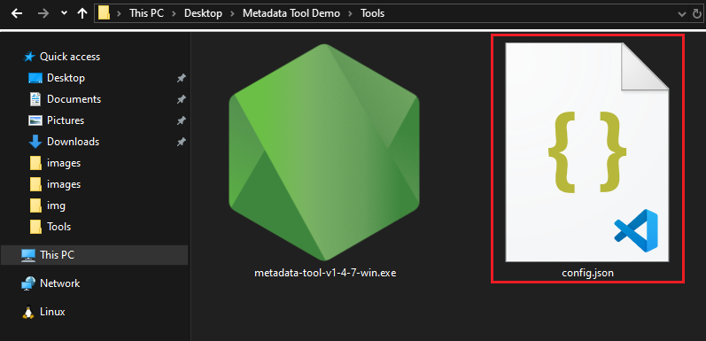
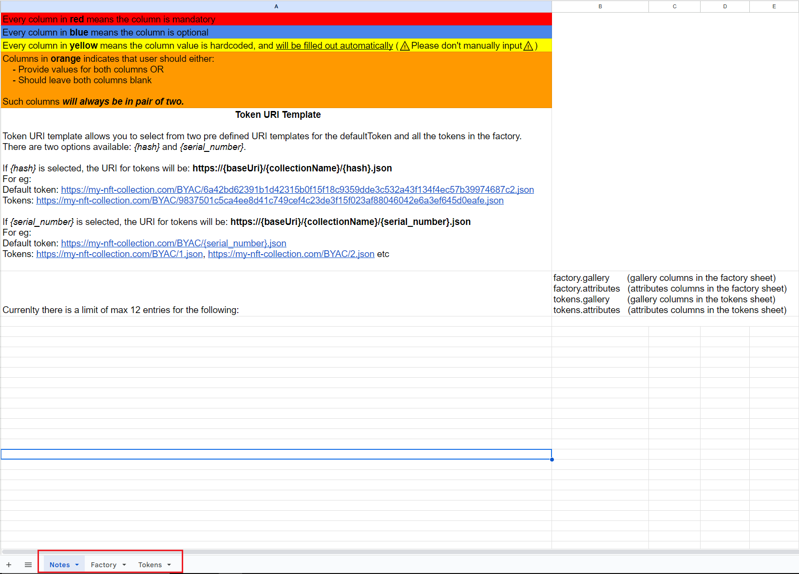
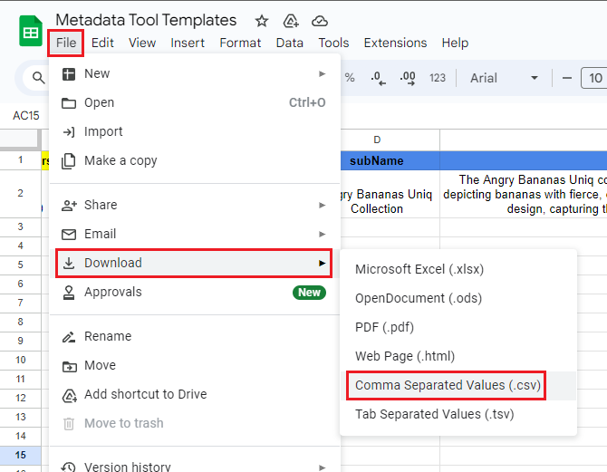
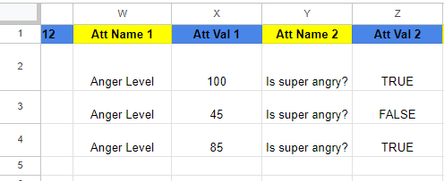
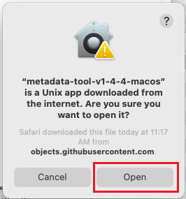

# How to create Uniq Metadata

Uniqs are tokens that can be associated with anything; games, assets, keys, items, and much more. The data that represents those things _is the metadata_. The title, the descriptions, and the images are all metadata.

Ultra has a specific format for how we expect metadata to be organized.

## Prerequisites

-   A basic understanding of [Factory Metadata](../uniq-variants/factory-metadata.md), [Default Uniq Metadata](../uniq-variants/uniq-default-metadata.md) and [Uniq Metadata](../uniq-variants/uniq-metadata.md).
-   You will need a Google account to make a copy of the [Metadata Template Google Sheet](https://docs.google.com/spreadsheets/d/1Gi0iuJis-riKkyhYgMRYVnhGD6PbjvBv8U7lhRwdhNk/edit?usp=sharing).
-   A Windows, Linux or MacOS machine to run the metadata tool on.

## Goal

The goal of this guide is to help you create JSON metadata files for your first Uniq Factory.

## What is Metadata Tool?

The metadata tool simplifies the process for creating metadata for complicated uniq factories and associated uniqs by allowing the user to specify uniq factory specifications and corresponding uniq(s) specifications in an easy to use CSV template.

Metadata tool takes CSVs and media files (Uniq images, videos and other supported media files) as inputs, converts to files to JSON objects, validates the JSON data, generates SHA256 hashes of the JSON objects and outputs the generated metadata JSON files.


_It is important to highlight that the metadata tool itself does not interact with the blockchain; instead, it streamlines the creation of metadata for complex uniq factories and their associated uniqs._

## Obtaining Metadata Tool

1. Download the binary/executable for the latest version of the tool from [here](https://github.com/ultraio/metadata-tool/releases).

## Setup Metadata Tool

1. Create a `config.json` file in the same directory as your binary/executable.



The configuration file (`config.json`) is a JSON object that allows user to map environment names to their corresponding base URIs. Each environment corresponds to a specific environment in which the metadata and media file for a Uniq factory and associated uniq(s) are to be be hosted/uploaded.

Here's an example of what the config file _might_ look like:

```json
{
    "production": "https://www.my-nft-website.com",
    "staging": "https://staging.my-nft-website.com",
    "mys3bucket": "https://s3.us-east-1.foobar.com",
    "custom": "https://www.my-custom-env.com"
}
```

In the example above, the `production`, `staging`, `mys3bucket` and `custom` environments are mapped to their corresponding base URIs. When the tool is run, it will read the config file and will prompt the user to select either one of the provided environments. The corresponding URI for the selected environment will be used as _base URI_ for the generated factory and uniq(s).

Note that the environments and base URIs in the config file shown above are just examples, and you should replace them with the actual environment(s) for your use-case.

### What qualifies as a valid environment URL?

In theory, any service capable of serving JSON and media content over **predictable URLs** should work. A predictable URL is one where the URL structure follows a consistent and recognizable pattern, making it easy to infer the URL for different files based on their location and names. The general structure of the predictable URLs is:

`Base URI + Collection Name + File Name`

For example:

-   Base URI: `www.my-uniq.com`
-   Collection Name: `Angry Bananas`
-   File Name: `factory.json`, `1.token.json`, `product.png` etc

Predictable URLs:

-   `www.my-uniq.com/AngryBananas/factory.json`
-   `www.my-uniq.com/AngryBananas/1.token.json`
-   `www.my-uniq.com/AngryBananas/product.png`

#### ✔️ Example of a valid environment URL:

An AWS S3 bucket is a good example of a valid environment to host your metadata files since the URLs are predictable and follow this pattern:

-   `https://s3.us-east-1.amazonaws.com/AngryBananas/factory.json`
-   `https://s3.us-east-1.amazonaws.com/AngryBananas/1.token.json`

In this case, if you know the bucket name and the file name, you can easily predict the URL. Example of a config file using an AWS S3 bucket is:

```json
{
    "production": "https://s3.us-east-1.amazonaws.com/",
    "staging": "https://s3.ap-southeast-2.amazonaws.com/"
}
```

#### ❌ Example of an invalid environment URL:

On the other hand, Dropbox does not provide predictable URLs. When uploading files to the same folder in Dropbox, the URL prefixes are different and not easily predictable. For example:

-   `https://dl.dropbox.com/scl/fi/o0mlbvyjroktfj6r0g3gn/factory.json?rlkey=f70l90yj01d61c0m8j43yt2pm&st=ss8gx8vj&dl=0`
-   `https://dl.dropbox.com/scl/fi/u2s3b2u5mahefssuzyut7/1.token.json?rlkey=td31270rsy6sfzwgi3sq2rqyr&st=8dqgyg1b&dl=0`

In this case, even though the files are in the same folder, the URL structure is not consistent and cannot be easily inferred.

For our needs, we require a service that allows us to predict the URL prefix. This is important so that we can use these URLs in our configuration file without having to manually update each one.

---

For the sake of this guide, we'll be creating a `config.json` that looks like this:

```json
{
    "developerDocs": "https://developers.ultra.io/uniq-collections/",
    "myS3Bucket": "https://s3.us-east-1.amazonaws.com/"
}
```

**Note**: If you do not provide a config file, the tool will prompt you to enter a base URI manually.

Once you have obtained the tool and created your config file, the next step is to setup the folder structure along with the media files, followed by adding data to the CSV template.

## Setup Folder Structure

Create a directory for your Uniq collection and its associated metadata. For simplicity's sake, we're going to create a flat structure and use a single directory that contains all the relevant media files and the metadata.

```
AngryBananas/ 📁 (This is your Root Folder)
|- factory.csv
|- tokens.csv
|- square.png
|- product.png
|- hero.png
|- gallery.png
```

We provide a template example for you to use in the context of this guide.

[](/zip/AngryBananas.zip)

## Setup CSV Template

Before we start using the CSV template, it is important to understand how the media file paths work in the CSV template, as well as which media types are supported.

### Image/Media Paths

There are two ways to link to an image/media file in your CSV file. One is _relative path_, and the other is an _external HTTP or HTTPS address_.

-   Relative Path: `./product.png` (Relative to your root folder)
-   External: `https://some-external-website.com/product.png`

### Supported Media Types

Metadata tool currently only supports the follow media types:

-   `jpg` / `jpeg`
-   `png`
-   `bmp`
-   `gif`
-   `webp`
-   `mp4`
-   `webm`

### Supported Token URI Template

The CSV template supports two pre defined URI templates for the default Uniq and all other the Uniqs in the factory.
There are two options available: `{hash}` and `{serial_number}`.

-   If `{hash}` is selected, the URI structure for Uniqs will be: `https://{baseUri}/{collectionName}/{hash}.json`.

    For example:

    -   Default Uniq: `https://www.my-uniq.com/AngryBananas/6a42bd...b39974687c2.json`
    -   Uniqs: `https://www.my-uniq.com/AngryBananas/983750...6a3ef645d0eafe.json`

-   If `{serial_number}` is selected, the URI structure for Uniqs will be: `https://{baseUri}/{collectionName}/{serial_number}.json`.

    For example:

    -   Default Uniq: `https://www.my-uniq.com/AngryBananas/{serial_number}.json`
    -   Uniqs: `https://www.my-uniq.com/AngryBananas/1.token.json`, `https://www.my-uniq.com/AngryBananas/2.token.json` etc

### Adding Data to the CSV Template

The next step is to add data to the CSV template.

1.  Open [Google Sheets Metadata Tool Template](https://docs.google.com/spreadsheets/d/1Gi0iuJis-riKkyhYgMRYVnhGD6PbjvBv8U7lhRwdhNk/edit?usp=sharing) and go to `File -> Make a Copy` to make a copy in your own Google Drive.
2.  Open the copied CSV template in your Google Drive and begin modifications of individual fields.

    The first sheet, called `Notes`, includes information regarding the template. This is important to read as this will help you understand the structure, rules, and limitations of the CSV template.

    All columns on the CSV template are color coded to help you understand the template better.

    -   <span style="color:red">**Red**</span> indicates that the column value is required and must be provided.
    -   <span style="color:blue">**Blue**</span> indicates that the column value is optional and can be skipped.
    -   <span style="color:yellow">**Yellow**</span> indicates the column value is pre-defined, and will be filled out automatically. You do not need to provide any input to such columns.
    -   <span style="color:orange">**Orange**</span> indicates that user should either provide values for both columns, or, should leave both columns blank. Such columns will always be in pair of two.

        

    There are two more sheets in the CSV template, called `Factory` and `Tokens`.

#### Adding Factory Data

1. To add factory data, go to the factory sheet by clicking on `Factory` from the sheets list.
2. Add the data to the following columns:
    - `specVersion`: Auto-filled, this column will be automatically filled once you provide a collection name.
    - `name`: Required, the name of your collection.
    - `Token URI Template`: Required, select either `{serial_number}` or `{hash}`. Refer to [Supported Token URI Template](#supported-token-uri-template) for more information.
    - `subName`: Optional, a sub name for the collection.
    - `description`: Optional, a description for the collection.
    - `author`: Optional, name of the author.
    - `defaultLocale`: Auto-filled, this column will be automatically filled once you provide a collection name.
    - `product`: Required, the relative path, or external URL to the product media file for the factory.
    - `square`: Required, the relative path, or external URL to the square media file for the factory.
    - `hero`: Optional, the relative path, or external URL to the hero media file for the factory.
    - `gallery 1`: Optional, the relative path, or external URL to the first gallery media file for the factory. You can include up to 12 gallery images by using the columns labeled `gallery 1`, `gallery 2`, `gallery 3`, and so on.
    - `Att Type 1`: Optional, the data type of the first attribute of this collection. You can double click on this column to choose from a list of pre-defined data types.
        - `Att Name 1`: Required if `Att Type 1` was provided. The name of the attribute.
        - `Att Desc 1`: Optional, a description for the attribute.
        - You can include up to 12 attributes by using the columns labeled `Att Type 1` `Att Name 1` `Att Desc 1`, `Att Type 2` `Att Name 2` `Att Desc 2`, and so on.


3.  Once you're done filling out data in the `Factory` sheet, export the `Factory` sheet as a CSV file by clicking on `File -> Download -> Comma Separated Values (.csv)`
    
4.  Rename the downloaded CSV file to `factory.csv` and place in your root folder. (Refer to [Setup Folder Structure](#setup-folder-structure) step)

#### Adding Uniq Data

1. To add data for uniqs, go to the uniqs sheet by clicking on `Tokens` from the sheets list. You can add the desired number of uniqs to your factory by adding a new row for each uniq that you want to create.
2. Add the data to the following columns:
    - `serialNumber`: For the first uniq, you can select `default` if you want to create a [default uniq](../uniq-variants/uniq-default-metadata.md), or you can select `1`, if you do not want to create a default uniq. If you select the `default` option, the next uniq that you add will be assigned serial number `1`. It is important to highlight that <ins>serial numbers are automatically generated</ins> for each uniq that you add to the collection.
    - `specVersion`: Auto-filled, this column will be automatically filled once you provide a uniq name.
    - `name`: Required, the name of your uniq.
    - `subName`: Optional, a sub name for the uniq.
    - `description`: Optional, a description for the uniq.
    - `author`: Auto-filled using the `author` column value provided in `Factory` sheet.
    - `defaultLocale`: Auto-filled, this column will be automatically filled once you provide a uniq name.
    - `product`: Required, the relative path, or external URL to the product media file for the Uniq.
    - `square`: Required, the relative path, or external URL to the square media file for the Uniq.
    - `hero`: Optional, the relative path, or external URL to the hero media file for the Uniq.
    - `gallery 1`: Optional, the relative path, or external URL to the first gallery media file for the Uniq. You can include up to 12 gallery images by using the columns labeled `gallery 1`, `gallery 2`, `gallery 3`, and so on.
    - `Att Name 1`: Optional, the data type of the first attribute of this collection. You can double click on this column to choose from a list of pre-defined data types.
        - `Att Name 1`: Auto-filled using the data provided in the `Factory` sheet.
        - `Att Val 1`: Required if the data for `Att Name 1` exists. This column represents the attribute value for the specific attribute defined in `Factory` sheet.
        - If you have included additional attributes in the `Factory` sheet, you must provide a value for each attribute.




3.  Once you're done filling out data in the `Tokens` sheet, export the `Tokens` sheet as a CSV file by clicking on `File -> Download -> Comma Separated Values (.csv)`
4.  Rename the downloaded CSV file to `tokens.csv` and place in your root folder.

<!-- ### Running the tool: -->

## Running the Metadata Tool

Once you have set up your folder structure and created the CSVs for factory and uniqs, the next step is to run the metadata tool. Before we begin, please note the following:

-   A report is always generated during runtime, but it is only saved to a file once you close the tool.
-   Reports will help you debug your CSV files; any missing information will be noted in the report and sometimes in the terminal/console window.

### Starting the Tool

Starting the tool is different for each operating system. Follow the steps for your operating system:

#### Windows

On Windows you can drag and drop your collection root folder onto the executable. Or, you can open the metadata tool by simply double clicking the executable.

#### Linux

Follow these steps to run the linux binary:

1.  `cd` to the directory where metadata tool binary is present.

2.  Make it executable by running this command in your terminal:

    `sudo chmod +x metadata-tool-v1-4-8-linux`

3.  Start the tool by running this command in your terminal:

    `./metadata-tool-v1-4-8-linux`

#### MacOS

Follow these steps to run the MacOS binary:

1.  `cd` to the directory where metadata tool binary is present.

2.  Make it executable by running this command in your terminal:

    `sudo chmod +x metadata-tool-v1-4-8-macos`

3.  `Ctrl` + `Right Click` on the binary/executable and then click `Open`. It will ask you if you want to open it. Click on `Open` again.
    

### Working Directory Input

Once you have started the metadata tool, it will prompt you to enter the path to your root folder. Enter the relative, or absolute path to your collection root folder, and press `Enter` key to submit.


We have used the relative path `../AngryBananas` here because on our system the `AngryBananas` directory exists at `../`, relative to the metadata tool executable. You should use the relative path depending on where your collection root directory exists. Or, you can also use the full absolute path to your collection root directory.

On Windows if your metadata tool executable is next to the root directory then you can just enter the root directory name like `AngryBananas` and it will also work.

### Environment Selection

You will now be prompted to select betweens the environments that you have specified in the config file. Use arrow keys to select the desired environment, and press `Enter` key to proceed.


### File Validation and Processing

Metadata tool will now process and validate the CSV files to generate the JSON metadata. If successful, you will see the success message. If there are some errors, they will be printed on the screen.


Press the `Enter` key to exit and close the metadata tool. Once closed, a report will be generated in the folder where your metadata tool binary/executable is located. A sample report looks like this:

```
[02:29:34] Started Metadata Tool v1.4.8
[02:29:34] Initialized Exit Handlers
[02:29:34] Reading specified folder path.
[02:29:34] Processing folder path: ../AngryBananas/
[02:29:34] Validating file list.
[02:29:34] tokens.csv file was also found in the provided directory.
[02:29:34] Prompting user for URL selection.
[02:29:36] Parsing file types for csv
[02:29:36] Collection name: Angry Bananas, env: developerDocs, url: https://developers.ultra.io/uniq-collections
[02:29:36] Validating schema files.
[02:29:36] Attempting to validate factory.
[02:29:36] factory passed
[02:29:36] Attempting to validate defaultToken.
[02:29:36] defaultToken passed
[02:29:36] Attempting to validate tokens.
[02:29:36] All Schemas Passed
[02:29:36] Building Hashes
[02:29:36] Replacing URLs with Hashed Content
[02:29:36] Writing default token to file.
[02:29:36] Writing factory to file.
[02:29:36] Writing token 1 to file.
[02:29:36] Writing token 2 to file.
[02:29:36] Writing final file: ../AngryBananas/upload.json
[02:29:36] Finished Processing. Press [Enter] to Exits
```

### Generated Metadata Files

If there were no errors, the metadata tool will create the following files in the collection's root directory, and your root directory should be similar to:

```
AngryBananas/ 📁 (This is your Root Folder)
 |-generated_media/ 📁
 | |-6057d2edc51714503c5c45795d4db998ac740eba5fa98beee99ca4aafc3def61.png
 | |-6db53e6353bf3a99aec0c73a884e0b4fa642d50868cf29895c614800306e3205.png
 | |-8719cb0820013ed612ac2045b360b6b1ad5ab510bf9c6ab6ca8c7e09f820ea7c.png
 | |-969f723aff5d40fefce3749cc3be9eb3b6932fe10af6655954f5d85e5313edd2.png
 |-1d5a17f4de3940e1891a1c98e51c9bd1ea2a137a264e10d1e542aeae89e1a0fd.json
 |-{serial_number}.json
 |-1.json
 |-2.json
 |-factory.csv
 |-gallery.png
 |-hero.png
 |-product.png
 |-square.png
 |-tokens.csv
 |-upload.json
```

-   `factory.json`: The JSON metadata file for the uniq factory.
-   `defaultToken.json`: The JSON metadata file for the default uniq, if a default uniq was specified in the CSV template. In this guide the `defaultToken.json` will be unused because the `default_token_uri` of the factory will later be replaced with the template URI of individual Uniqs using `{serial_number}`. The same would apply to `{hash}` template value.
-   `1.token.json`: The JSON metadata file for uniq with serial number 1, and so on, for each uniq specified in the CSV template.
    -   If you specified `{hash}` as the `Token URI Template`, then your uniq metadata files will be named as the SHA256 hash of their file contents.
-   `generated_media`: This directory contains all the media files. Each file is renamed as the SHA256 hash of its content.
-   `upload.json`: The `upload.json` file contains the details regarding the uniq collection. Such as the collection name, factory/uniq hashes & URLs, and media URLs.

### Output File Explained

It is important to understand that the `upload.json` file <ins>is not part of the actual metadata</ins>, rather it is generated as a help for you to understand where you _should_ upload/host the generated metadata files.

For our example collection, the `upload.json` file should look like this:

```json
{
    "collectionName": "Angry Bananas",
    "factory": {
        "hash": "7af64e35ed9cceaf71e7362171784e7ba3d6d9ac8f62a154aa1d3605ab108789",
        "url": "https://developers.ultra.io/uniq-collections/AngryBananas/7af64e35ed9cceaf71e7362171784e7ba3d6d9ac8f62a154aa1d3605ab108789.json"
    },
    "defaultToken": {
        "hash": "255cb93b1f53ff9ec1d4c5b5d8bff1fc2c6661c847cd2fd3b3376640483d510a",
        "url": "https://developers.ultra.io/uniq-collections/AngryBananas/{serial_number}.json"
    },
    "tokens": [
        {
            "serialNumber": "1",
            "hash": "2da6b5b4d8ecf25ac3b472c16264b02c48d35833196a262db562ea988e34417f",
            "url": "https://developers.ultra.io/uniq-collections/AngryBananas/1.json"
        },
        {
            "serialNumber": "2",
            "hash": "bc34facf773a7162eb1aa51a38c901e9e1cd23c9a66c8f0f0e5adb6746b55e98",
            "url": "https://developers.ultra.io/uniq-collections/AngryBananas/2.json"
        }
    ],
    "media": {
        "generated_media/51aa8699ebc19560234ce8db808e13f88069784c925838157a4d33da486742d9.png": "https://developers.ultra.io/uniq-collections/AngryBananas/51aa8699ebc19560234ce8db808e13f88069784c925838157a4d33da486742d9.png",
        "generated_media/9a4a2560f581f3982ce9c6daf58d0da673432868cd16b2191ce279d8a8ae4c01.png": "https://developers.ultra.io/uniq-collections/AngryBananas/9a4a2560f581f3982ce9c6daf58d0da673432868cd16b2191ce279d8a8ae4c01.png",
        "generated_media/d602c91d1a14a8e91ac6033f56fcdcaacf99d60de8c73ebc79d5dcb6fd56d6d0.png": "https://developers.ultra.io/uniq-collections/AngryBananas/d602c91d1a14a8e91ac6033f56fcdcaacf99d60de8c73ebc79d5dcb6fd56d6d0.png",
        "generated_media/f13775bd0af14d582b6eb840bea01fc0e411b9fcb5b5bdbb2c8c78e0fb24c311.png": "https://developers.ultra.io/uniq-collections/AngryBananas/f13775bd0af14d582b6eb840bea01fc0e411b9fcb5b5bdbb2c8c78e0fb24c311.png"
    },
    "environment": {
        "env": "developerDocs",
        "tokenUriTemplate": "{serial_number}",
        "url": "https://developers.ultra.io/uniq-collections",
        "toolVersion": "1.4.8"
    }
}
```

Based on above details, we have uploaded the metadata and media files to the specified URLs:

-   Factory metadata: https://developers.ultra.io/uniq-collections/AngryBananas/7af64e35ed9cceaf71e7362171784e7ba3d6d9ac8f62a154aa1d3605ab108789.json
-   Default uniq metadata: not uploaded because it will not be used. It would be required if we didn't use the `{serial_number}` template.
-   Uniq #1 metadata: https://developers.ultra.io/uniq-collections/AngryBananas/1.json
-   Uniq #2 metadata: https://developers.ultra.io/uniq-collections/AngryBananas/2.json
-   Generated medias:
    -   https://developers.ultra.io/uniq-collections/AngryBananas/51aa8699ebc19560234ce8db808e13f88069784c925838157a4d33da486742d9.png
    -   https://developers.ultra.io/uniq-collections/AngryBananas/9a4a2560f581f3982ce9c6daf58d0da673432868cd16b2191ce279d8a8ae4c01.png
    -   https://developers.ultra.io/uniq-collections/AngryBananas/d602c91d1a14a8e91ac6033f56fcdcaacf99d60de8c73ebc79d5dcb6fd56d6d0.png
    -   https://developers.ultra.io/uniq-collections/AngryBananas/f13775bd0af14d582b6eb840bea01fc0e411b9fcb5b5bdbb2c8c78e0fb24c311.png

You have now successfully generated the metadata for your uniq collection.

## What's next?

Once you have generated the metadata for your uniq collection, the next steps are to:

-   [How to validate metadata using Ultra Toolkit's Schema Validator](./how-to-validate-uniq-metadata-using-schema-validator-toolkit.md)
-   [How to create a Uniq Factory using the Ultra Toolkit](./how-to-create-uniq-factory-using-toolkit.md)
