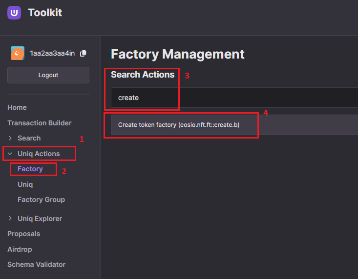

# How to mint a Uniq using the Ultra Toolkit

## Prerequisites

-   You must have created a uniq factory. Refer to [How to create a Uniq Factory using the Ultra Toolkit](./how-to-create-uniq-factory-using-toolkit.md) for more information.
-   Your account must have sufficient UOS tokens for transactions and fees. Refer to [Tutorial - Using the Faucet and Buying RAM on Ultra Testnet](../../fundamentals/tutorial-obtain-token-and-purchase-ram.md#obtaining-uos-tokens-using-the-faucet) for more information.

## Goal

The goal of this guide is to help you mint your first Uniq.

## Accessing the Toolkit

To access the Ultra Toolkit, please visit: https://toolkit.ultra.io

Once you're on the Toolkit homepage, click on the network selection component on the top right of your screen.

Clicking on the network selection component will open up a list of available networks that you can use the toolkit on. For the sake of this tutorial, we will be using the Ultra Testnet. From the list of available networks, click on `Testnet`.

Login to the Ultra Toolkit using Ultra Wallet. Refer to [Tutorial - Log in to the Ultra Toolkit](../../fundamentals/tutorial-login-to-toolkit.md) for more information.

## Minting a Uniq

### 1. Accessing Factory Management Page

Once you've logged in to the toolkit, from the toolkit home page, click on the `Uniq Actions` from the sidebar, and then click on `Factory` to open the uniq factory actions page.

On the factory page, search for `issue` action in the search box, and click on the `Issue tokens (eosio.nft.ft::issue.b)` action to open up the transaction modal.

### 2. Configure `issue.b` Action

We are going to use the `issue.b` action to mint a uniq. For more information on the action, refer to [issue.b action documentation](../../../blockchain/contracts/nft-contract/nft-actions/issue.b.md).

Once you have opened the transaction modal, fill the required fields for the `issue.b` action:
