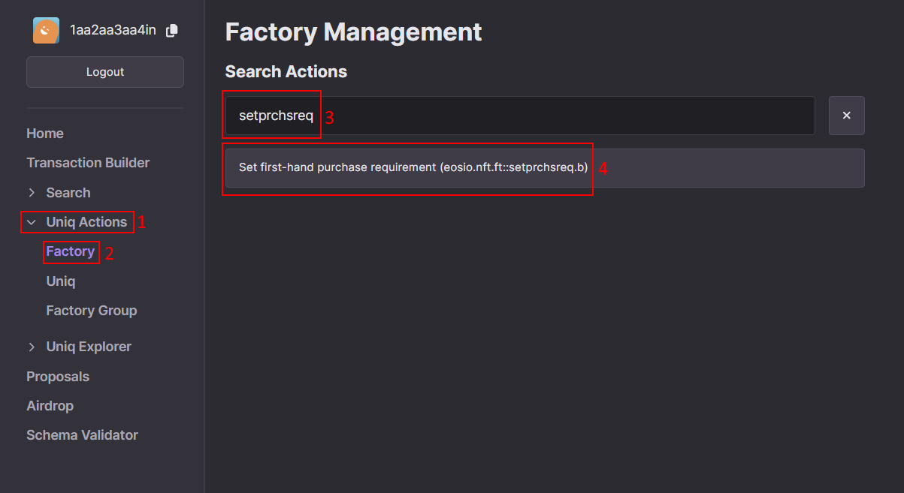
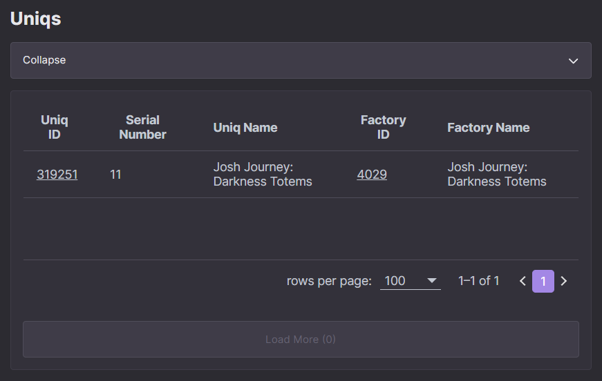
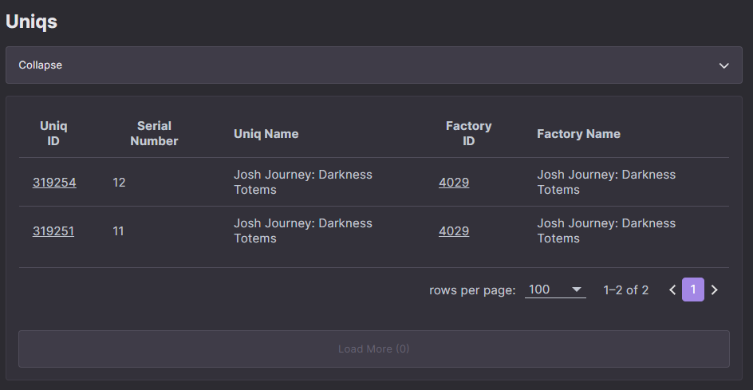
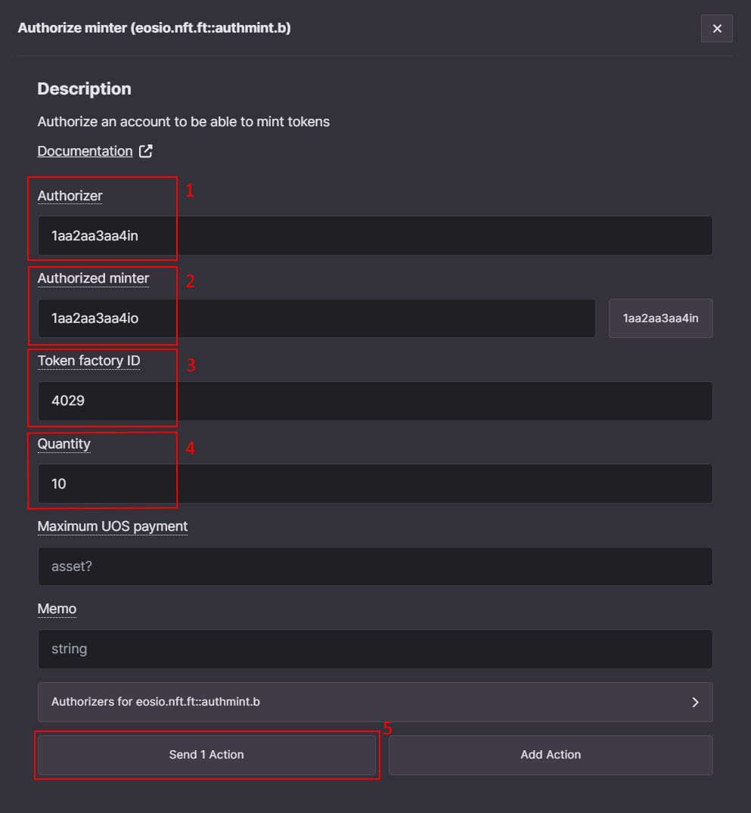
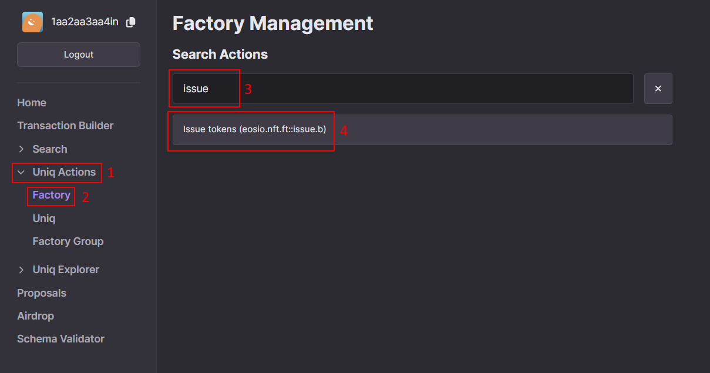

# How to perform advanced actions with Uniqs and Factories

After you have successfully created a factory and potentially minted some tokens, you may now want to check what else can you potentially do.

This guide will cover advanced actions that apply to Uniqs and Factories using the Ultra Toolkit.

## Prerequisites

-   Created a Uniq Factory. Follow the [Factory creation guide](../creating-uniq-factories/how-to-create-uniq-metadata.md) for details.
-   Your account must have sufficient UOS tokens for transactions and fees. If you don't have tokens, see [how to use Faucet](../../fundamentals/tutorial-obtain-token-and-purchase-ram.md) for Testnet or [how to buy UOS](../../guides/how-to-buy-uos.md) for Mainnet.
- A developer account on the Ultra Testnet or Mainnet and to be logged into the Ultra Toolkit. If you don't have it, please follow our previous tutorial: [Tutorial - Log in to the Ultra Toolkit](../../fundamentals/tutorial-login-to-toolkit.md).

## Goal

The goal of this guide is to demonstrate the range of actions you can perform with your Uniqs and Factories using Ultra Toolkit. This includes the process of adding or removing a direct purchase from your Factory; transferring and burning Uniqs; adding authorized minters.

## How to add first-hand purchase to your factory

First-hand purchase is a feature of NFT contract that allows factory managers to add a purchase option so that users can directly mint Uniqs themselves while paying some UOS or USD fee, or by potentially burning or transferring Uniqs. You can also require user to own some specific Uniq in order to use the purchase option.

You can see the list of potential use cases of this feature on the dedicated [Factory Purchase Options](../factory-management/factory-purchase-options.md) page.

To create a simple purchase option first navigate to [Factory management actions](https://toolkit.ultra.io/factoryManagement) and search for `setprchsreq`.

After finding it, select `Set first-hand purchase requirement (eosio.nft.ft::setprchsreq.b)` action.

There are multiple fields, here we will provide a short breakdown for each of them. For more details refer to [action documentation](../../../blockchain/contracts/nft-contract/nft-actions/setprchsreq.b.md).

- **Token factory ID** - The ID of the token factory you manage and want to modify. You must be a manager of that factory
- **Purchase option index** - A number that will let you identify the purchase option, in case there are multiple options per factory. It can be any positive number you want, we advise you to start from 0 and increase it by one for any new purchase option you add. Note that if you set the purchase requirement with an existing index then it will overwrite it.
- **Purchase price** - Required payment in UOS or USD (will be converted to UOS at the time of purchase) to be able to purchase a Uniq. It can also be set to 0 but only if the `Purchase option with Uniqs` is set.
- **Purchase limit** - Dictates the maximum number of Uniqs that can be bought using this option specifically. The limit is not shared between the options. If you need to have a total cap then you better manage it though the minting limit of the factory. Optional, can leave it empty.
- **Promoter basis point** - A share of UOS that a promoter will get at the time of purchase, specified in basis points. Must be at least 200 (which is equal to 2%).
- **Purchase option with Uniqs** - Allows you to specify the price for this purchase option using Uniqs from other factories or to require the buyer to own Uniqs from specific factories. This field is covered in more detail in the later example in this guide.
- **Sale shares** - Specifies the list of accounts who will get a share of UOS from the purchase done using this purchase option. The `Basis points` field determines how much the account will get, specified in basis points (1 point = 0.01%). Optional, can leave it empty.
- **Maximum UOS payment** - The maximum amount of UOS you are ok to pay to create the purchase option. The payment is only used to cover RAM costs and is predictable. Optional, can leave it empty.
- **Group restriction** - Allows you to specify user groups who are able or not able to use this purchase option. Refer to [action documentation](../../../blockchain/contracts/nft-contract/nft-actions/setprchsreq.b.md) for a deeper explanation on how to use the user group restriction. Optional, can leave it empty.
- **Purchase window start** - Makes it so the purchase option is only available starting at some point in time in the format of `2021-05-01T00:00:00`. Optional, can leave it empty.
- **Purchase window end** - Makes it so the purchase option is only available until some point in time in the format of `2021-05-01T00:00:00`. Optional, can leave it empty.
- **Memo** - Simple text message that can be used for various purposes. Does not affect the result of the transaction. Optional, can leave it empty.

Click on `Send 1 Action`, review the details, and confirm your transaction.

You can now navigate to [Factory explorer](https://toolkit.ultra.io/uniqFactory), enter your Factory ID. After scrolling down you will see the newly added purchase option.

## How to buy a Uniq using a first-hand purchase option

To purchase a Uniq directly using the new purchase option navigate to [Factory management actions](https://toolkit.ultra.io/factoryManagement).

Search for `purchase` and select `Purchase Uniqs directly (eosio.nft.ft::purchase.a)`.

Now you need to fill the action form. There are multiple fields that you need to fill and here we will provide a short breakdown for each one of them.

- **Token factory ID** - The ID of the factory from which you want to purchase a Uniq.
- **Index** - Purchase option index that was specified in `setprchsreq.b` action.
- **Maximum UOS payment** - Maximum amount of UOS that you are willing to use for this purchase. It must be at least equal to the current price of the purchase option converted to UOS (in case it is originally specified in USD). You can put a larger value here but you will not be charged more than the current price at the time the transaction is executed. If the price of the purchase option is already in UOS then you can use the same value here.
- **Buyer** - The account that signs a transaction and who will pay the required amount of UOS and, if required, the Uniqs needed for this purchase option.
- **Receiver** - The account that will get the Uniq after the purchase is done. It can be the same as the `Buyer` in most cases.
- **Promoter** - The account that will get a share of UOS from this purchase. If you are building a marketplace you would want to specify your account as a promoter to receive a share of UOS from each purchase. If not specified then Ultra will be used as a promoter.
- **Provided Uniqs** - The list of Uniqs that you want to check, burn, or transfer. This is required if the purchase option specifies `Purchase option with Uniqs`. The example on how to fill this field will be provided later in this guide.
- **Memo** - Simple text message that can be used for various purposes. Does not affect the result of the transaction. Optional, can leave it empty.

For more details see the [action documentation](../../../blockchain/contracts/nft-contract/nft-actions/purchase.a.md).

After you have filled the form, click on `Send 1 Action`, review the details, and confirm the transaction.

Now you should be able to navigate to your inventory (either click on the `Inventory` on the hope page of the Toolkit https://toolkit.ultra.io/ or go to https://toolkit.ultra.io/user and enter desired account name manually).

You should be able to scroll down and see the list of Uniqs the account has. Note that it may take a minute for Ultra API to update and show your Uniq.

## How to set first-hand purchase requirement with a price in Uniqs

We will now cover the usage of `Purchase option with Uniqs` when creating a purchase option. This option allows you to require a payment to be done using Uniqs from other factories or to simply require a user to own a Uniq from a specific factory.

First, navigate to [Factory management actions](https://toolkit.ultra.io/factoryManagement), search again for `setprchsreq`, and select the `Set first-hand purchase requirement (eosio.nft.ft::setprchsreq.b)` action.

To specify the price in Uniqs you use the `Purchase option with Uniqs` field. You can add multiple entries to this field, each field corresponds to a single factory. Here is a breakdown for each of the fields:

- **Transfer tokens receiver account** - The account that will receive the Uniqs from the factories that use the strategy of 2 (transfer). This field is mandatory to specify if any of the factories use the strategy of 2 (transfer).
- **Required factories** - The list of factories required for this purchase option. Each one of them has the following fields:
    - **Token factory ID** - The ID of the factory that is required for this purchase option.
    - **Count** - How many Uniqs are required from the specified factory. Note that there is no way to specify any properties of the required Uniq, as long as it is from required factory it will work.
    - **Strategy** - There are 3 ways you can require Uniqs within your purchase option:
        - Check if account owns a Uniq from a specific factory (strategy 0)
        - Burn required Uniqs (strategy 1)
        - Transfer a Uniq from the owner to the account specified in `Transfer tokens receiver account` (strategy 2)

For more details see the [action documentation](../../../blockchain/contracts/nft-contract/nft-actions/setprchsreq.b.md).

In the following example we will configure a purchase option to burn a single Uniq will to mint another one. This effectively swaps user's Uniq from one to another. The price will be set to 0 UOS so the only requirement is to have a Uniq from the specified factory.

If you want to try and do the same you need to have a second factory or use the same one you already have. Note that if you reuse the same factory which does not have variants then it is effectively a useless operation as you will get a Uniq identical to the one you have burned.

After filling out the form, click on `Send 1 Action`, review the details, and confirm the transaction.

You can now navigate to [Factory explorer](https://toolkit.ultra.io/uniqFactory), enter your Factory ID, and scroll down to see the new purchase option created.

## How to buy a Uniq using a first-hand purchase option with price in Uniqs

The process of purchasing Uniq using the purchase option with Uniqs requirement is similar, but requires you to fill the `Provided Uniqs field`.

To do so, first navigate to [Factory management actions](https://toolkit.ultra.io/factoryManagement), and search again for `purchase` and select `Purchase Uniqs directly (eosio.nft.ft::purchase.a)`.

If the purchase option requires Uniqs from other factories then the account must have those Uniqs in its inventory. If you need to mint this Uniq then either refer to a [How to mint a Uniq using the Ultra Toolkit](../creating-uniq-factories/how-to-mint-uniq-using-toolkit.md) guide or add add a simple first-hand purchase option with UOS price to this factory and purchase it, as was described in this guide.

Here we minted a Uniq from factory 4030, which was specified in the previous step as a requirement for the purchase option with index 1.

Once you have the Uniq from the factory you specified in the purchase requirement, you will need to fill the `Provided user Uniqs` field.

- **Uniqs** - The list of Uniqs you provide to satisfy the purchase requirement. Note that the number of Uniqs should match the sum of all counts specified in purchase requirement. Providing more Uniqs will result in error.
    - **Uniq ID** - The ID of the Uniq you provide. It must be a Uniq the `Buyer` account owns.
    - **Strategy** - Determines what will happen to the Uniq and it must be identical to the one specified in the purchase requirement. This ensures the fact that you agree that this Uniq will be checked, burned, or transferred.

In this example we only need to provide a single Uniq and specify the strategy 1 (burn).

After clicking on `Send 1 Action`, reviewing the details, and confirming the transaction, you should be able to see your new Uniq in your [inventory](https://toolkit.ultra.io/user), as expected.

## How to transfer a Uniq to another account

For testing it may be necessary to transfer Uniqs manually and in greater quantities. You can use the toolkit to quickly assemble a transfer transaction and run it. For more details see the [action documentation](../../../blockchain/contracts/nft-contract/nft-actions/transfer.md).

First, navigate to [Uniq management actions](https://toolkit.ultra.io/uniqManagement), search `transfer`, and select the `Transfer token (eosio.nft.ft::transfer)` action.

You need to fill the following fields:

- **From** - The account that currently owns the Uniq, you have logged in with, and want to transfer the Uniq from.
- **To** - The receiver of the Uniq.
- **Token IDs** - A list of Uniqs that will be transferred, you can add multiple and send them all at once. To know the Uniq ID you can use the user [inventory page](https://toolkit.ultra.io/user).
- **Memo** - Simple text message that can be used for various purposes. Does not affect the result of the transaction. Optional, can leave it empty.

After clicking on `Send 1 Action`, reviewing the details, and confirming the transaction, you should be able to see the Uniq on the receiver account [inventory](https://toolkit.ultra.io/user).

## How to burn a Uniq manually

Burn action allows you to delete a token and get a UOS refund based on the portion of UOS that was spent to mint it. This effectively lets you get rid of Uniqs that are no longer needed. For more details see the [action documentation](../../../blockchain/contracts/nft-contract/nft-actions/burn.md).

First, navigate to [Uniq management actions](https://toolkit.ultra.io/uniqManagement), search `burn`, and select the `Burn a token (eosio.nft.ft::burn)` action.

You need to fill the following fields:

- **Owner** - The account that owns a Uniq and that you have logged in with.
- **Token IDs** - A list of Uniqs that will be burned. You can burn multiple Uniqs at a time.
- **Memo** - Simple text message that can be used for various purposes. Does not affect the result of the transaction. Optional, can leave it empty.

After clicking on `Send 1 Action`, reviewing the details, and confirming the transaction, you should no longer see the Uniq on the owner account [inventory](https://toolkit.ultra.io/user).

## How to add authorized minters to a factory

Sometimes it may be desired to allow accounts other than the factory manager to mint Uniqs from the factory. For this purpose the authorized minter feature is used. For more details see the [action documentation](../../../blockchain/contracts/nft-contract/nft-actions/authmint.b.md).

To do so, first navigate to [Factory management actions](https://toolkit.ultra.io/factoryManagement), and search again for `authmint` and select `Authorize minter (eosio.nft.ft::authmint.b)`.

You need to fill the following fields:

- **Authorizer** - The account that manages the factory or was previously authorized using authorized minter action.
- **Authorized minter** - The account that will be authorized to mint Uniqs from the factory or to delegate the minting authorization to other accounts.
- **Token factory ID** - The ID of the factory that the authorized minter will be allowed to mint from.
- **Quantity** - The maximum number of Uniqs that authorized minter will be allowed to mint. Mandatory to specify even if the factory has no limit on the number of Uniqs that can be minted.
- **Maximum UOS payment** - The maximum amount of UOS you are ok to pay to assign the authorized minter. The payment is only used to cover RAM costs and is predictable. Optional, can leave it empty.
- **Memo** - Simple text message that can be used for various purposes. Does not affect the result of the transaction. Optional, can leave it empty.

After clicking on `Send 1 Action`, reviewing the details, and confirming the transaction, the `Authorized minter` account will be allowed to mint the specific number of Uniqs from the factory.

To actually mint the Uniqs as authorized minter you need to utilize the `Authorizer` field of `issue` action. Navigate to [Factory management actions](https://toolkit.ultra.io/factoryManagement), and search for `issue` and select `Issue tokens (eosio.nft.ft::issue.b)`.

Similar to [How to mint a Uniq using the Ultra Toolkit](../creating-uniq-factories/how-to-mint-uniq-using-toolkit.md) guide you need to fill `To`, `Token factory ID` and `Amount`. But now you also need to additionally specify the `Authorizer`. The `Authorizer` must be an authorized minter assigned using the authorized minter action.

After clicking on `Send 1 Action`, reviewing the details, and confirming the transaction, you should be able to see the Uniq in the receiver account [inventory](https://toolkit.ultra.io/user).

## What's next?

TBA
